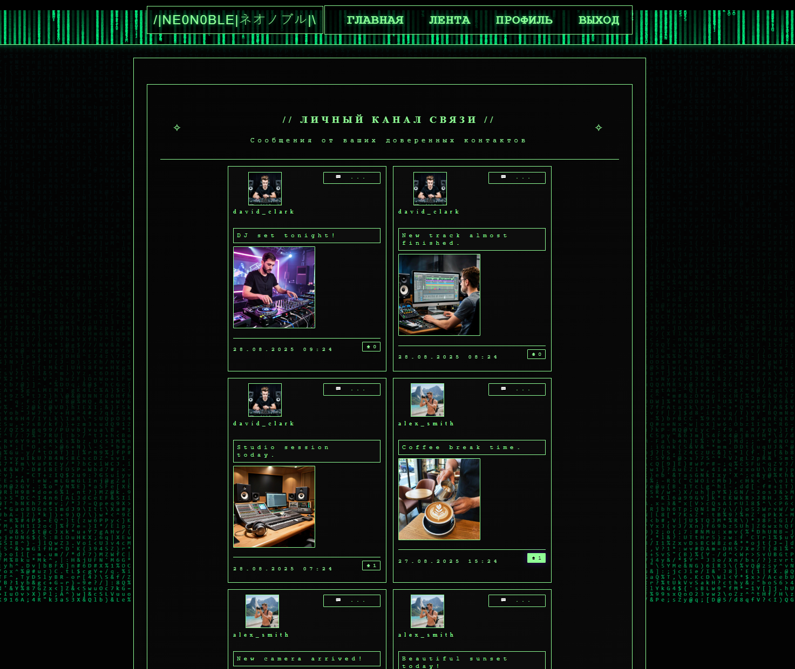
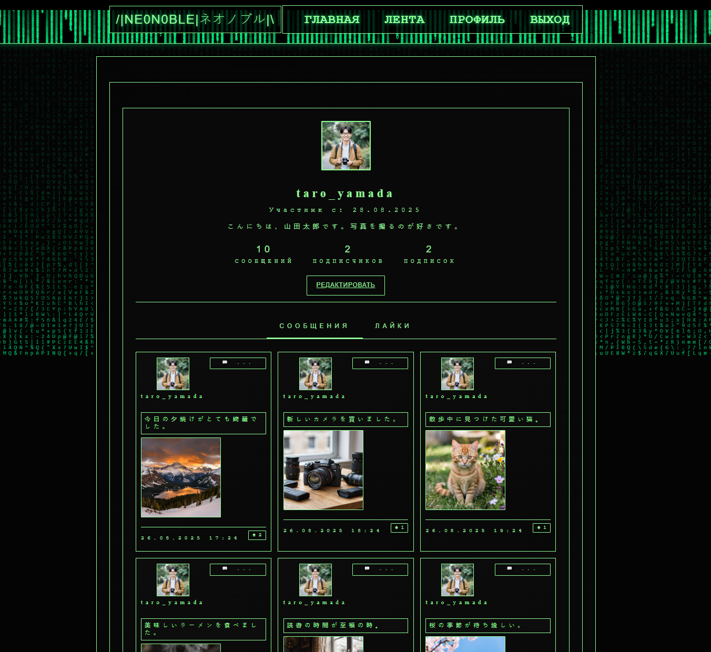
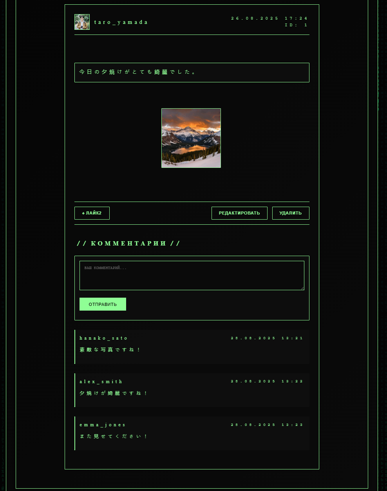
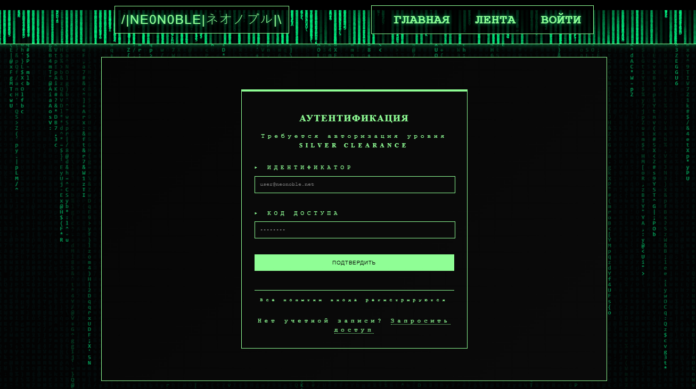
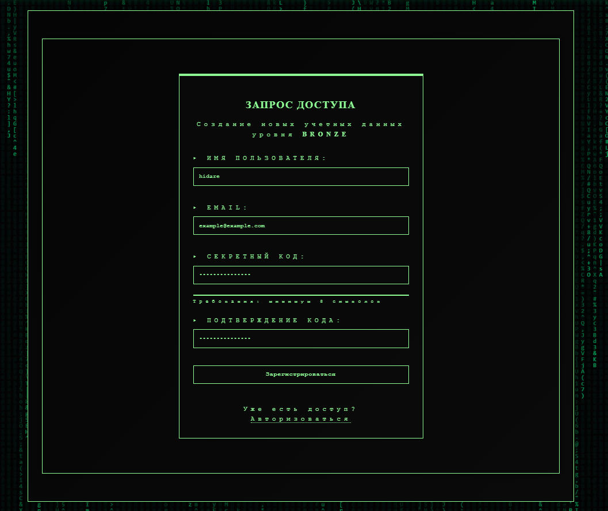

NE0N0BLE | ネオノブル
=


**NE0N0BLE** — это полнофункциональное веб-приложение (социальная сеть), построенная на микрофреймворке Flask. Проект воплощает эстетику киберпанка и японского неонобля, предлагая пользователям платформу для обмена постами, изображениями и создания собственного цифрового сообщества.


## ✨ Особенности и Функциональность

Приложение реализует полный цикл функций современной социальной платформы:

*   **👥 Аутентификация и Авторизация:** Система регистрации, входа и выхода. Пароли хранятся в захэшированном виде.
*   **📝 Лента публикаций:** Главная страница с постами всех пользователей и приватная лента только избранных авторов.
*   **🤝 Система подписок:** Пользователи могут подписываться друг на друга.
*   **❤️ Система лайков:** AJAX-лайки постов без перезагрузки страницы.
*   **💬 Комментарии:** Возможность комментировать посты.
*   **🖼️ Загрузка медиа:** Загрузка аватарок и изображений к постам.
*   **👤 Профили пользователей:** Персональные страницы с статистикой, вкладками (посты, лайки) и возможностью редактирования.
*   **🎨 Уникальный дизайн:** Кастомный CSS с неоновой киберпанк-тематикой, анимированный матричный фон на Canvas API.
*   **⚙️ Административные функции:** Удаление и редактирование контента (для авторов).

## 🛠️ Технологический Стек

*   **Backend:** Python 3, Flask, Flask-SQLAlchemy, Flask-Login, Flask-WTF, Werkzeug
*   **Frontend:** HTML5, CSS3 (Custom), Vanilla JavaScript (ES6+), Canvas API
*   **Database:** PostgreSQL
*   **Безопасность:** CSRF-токены, хеширование паролей, валидация форм, санитизация загружаемых файлов
*   **Архитектура:** Modular Blueprints (более 7 зарегистрированных блюпринтов для организации кода)

## 📦 Установка и Запуск

Необходим PostgreSQL.
Строка подключения к psql указывается в файле .env.

1.  **Клонируй репозиторий:**
    ```bash
    git clone https://github.com/your_username/neonoble.git
    cd neonoble
    ```

2.  **Создай и активируй виртуальное окружение:**
    ```bash
    python -m venv venv
    source venv/bin/activate  # Linux/macOS
    # или
    venv\Scripts\activate  # Windows
    ```

3.  **Установи зависимости:**
    ```bash
    pip install -r requirements.txt
    ```

4.  **Наполни базу данных тестовым контентом:**
    ```bash
    python CONTENT_FILLING.py
    ```
    *Это создаст 10 пользователей, 44 поста, лайки, комментарии и подписки.*

5.  **Запусти приложение:**
    ```bash
    python app.py
    ```

6.  **Открой в браузере:** [http://localhost:5000](http://localhost:5000)

## 📸 Скриншоты и Демонстрация

<details>
<summary><b>Разверни, чтобы увидеть больше скриншотов</b></summary>

| Взаимодействие с платформой                                          |
|:---------------------------------------------------------------------|
| **Лента публикаций**<br>       |
 **Просмотр профиля**<br>  |
| **Страница поста**<br>   |

| Процесс аутентификации | 
| :--- |
| **Вход в систему**<br> ||
| **Регистрация**<br> | 

</details>

## 🧩 Структура Проекта (Ключевые компоненты)
```
app/
├── 📁 IMAGE_FOR_CONTENT_FILLING/ # Изображения для наполнения БД
│ ├── 📁 avatars_images/ # Аватары для пользователей
│ └── 📁 posts_images/ # Изображения для постов
│
├── 📁 static/ # Статические файлы
│ ├── 📁 css/ # Стили
│ │ └── main.css # Главный файл стилей
│ ├── 📁 images/ # Статические изображения
│ │ └── default-avatar.png # Аватар по умолчанию
│ ├── 📁 uploads/ # Загружаемые файлы
│   ├── 📁 avatars/ # Аватары пользователей
│   └── 📁 posts/ # Изображения постов
│
├── 📁 templates/ # HTML шаблоны (Jinja2)
│ ├── 📁 auth/ # Шаблоны аутентификации
│ │ ├── login.html # Страница входа
│ │ └── register.html # Страница регистрации
│ │
│ ├── 📁 comment/ # Шаблоны комментариев
│ │ └── edit.html # Редактирование комментария
│ │
│ ├── 📁 errors/ # Шаблоны ошибок
│ │ ├── 403.html # Ошибка 403 (Доступ запрещен)
│ │ ├── 404.html # Ошибка 404 (Не найдено)
│ │ └── 500.html # Ошибка 500 (Серверная ошибка)
│ │
│ ├── 📁 post/ # Шаблоны постов
│ │ ├── create.html # Создание поста
│ │ ├── detail.html # Детальная страница поста
│ │ └── edit.html # Редактирование поста
│ │
│ ├── 📁 user/ # Шаблоны пользователей
│ │ ├── edit.html # Редактирование профиля
│ │ └── profile.html # Страница профиля
│ │
│ ├── base.html # Базовый шаблон
│ ├── feed.html # Лента публикаций
│ └── index.html # Главная страница
│
├── 📄 .env - Файл с секретами. SECRET_KEY - ключ приложения, DATABASE_URI - строка подключения к БД.
├── 📄 app.py # Основное приложение Flask
├── 📄 config.py # Конфигурационные параметры
├── 📄 CONTENT_FILLING.py # Скрипт наполнения БД данными
├── 📄 forms.py # Формы WTForms
├── 📄 models.py # Модели SQLAlchemy
├── 📄 routes_auth.py # Роуты аутентификации
├── 📄 routes_comment.py # Роуты комментариев
├── 📄 routes_error.py # Обработчики ошибок
├── 📄 routes_main.py # Основные роуты
├── 📄 routes_post.py # Роуты постов
├── 📄 routes_some.py # Дополнительные роуты
└── 📄 routers_user.py # Роуты пользователей
```

## 👨‍💻 Автор

**Нагорный Д**

*   Telegram: [@kagatuta](https://t.me/kagatuta)
*   Email: sagot9672@gmail.com

## 📄 Лицензия

Этот проект распространяется под лицензией **MIT**. См. файл `LICENSE` для подробностей.

> Вдохновлено: Киберпанком, терминалами, "Матрицей", аниме и эстетикой неонобля.
> 
> Статус проекта: Завершенный production-ready пет-проект.
> 
> Неонобль, неонобль, неонобль!